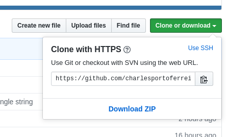

[\[back\]](../Readme.md)

## How to install

### Requirements
You will need [python](https://www.python.org/) 3.6 or later on your machine to run this code.
To check your python version type on a terminal:

       python3 --version
          
          
You should have an output similar to this:

        Python 3.6.8
        
To install python libraries, one may need a python installing package.
 We suggest using [pip](https://pypi.org/project/pip/).

### Libraries:

You will need the following python libraries to run this code:
nltk, stop-words, gensim, tensorflow, tensorflow-hub.

One may install these libraries using the [pip](https://pypi.org/project/pip/) tool.
 To do that, run the following commands:

        pip install nltk
        pip install stop-words
        pip install gensim
        pip install tensorflow
        pip install tensorflow-hub

### Embedding Models

To extract vectors from documents we are using a few pre-trained model. It is necessary to have a copy
of them on your machine.

* Google word2vec [model](https://drive.google.com/file/d/0B7XkCwpI5KDYNlNUTTlSS21pQmM/edit)
[link to the paper](http://arxiv.org/pdf/1301.3781.pdf)
* fastText [link to the model][link to the paper]
* Glove [link to the model][link to the paper]
* MSSA [link to the model][link to the paper]
* Elmo [link to the paper]
* USE [link to the paper]

### Download

Download this repository to your local machine 

or clone it with git clone.

       git clone https://github.com/charlesportoferreira/word2vec

### Project folder structure:

After download, go to the respected folder. You should have a project folder with the following structure:

        word2vec
        |
        |-----main.py
        |-----Readme.md
        |-----dataset
        |-----models
        |-----test
        |-----wordvector
        
       
### Dataset folder
It is necessary to keep your corpus inside the dataset folder.
They need to be organized in a tree format. There is already a toydata example inside this folder. 
 
    toydata
       |---book
       |     |----> d1.txt
       |     |----> d2.txt
       |     |----> d3.txt
       |
       |---paper
             |----> d4.txt
             |----> d5.txt
             |----> d6.txt
            
            
This corpus is composed of 6 text documents.
 Each document belongs to one of two classes: book or paper.

After running the code one will end up with a file composed of 
6 vectors. One vector to each document. The numerical values will be separated by commas, and the last value is the label of the document

### Models folder
In this folder, you need to keep your embeddings models

It is necessary to keep your corpus and models in the correct folder because we are using a relative path to find theses files. So if you put them in a parent folder from this project it may not be able to find these files,
unless you provide the flag -f True to inform that you are using full path.

### Creating a python 3 virtual environment

It is not necessary to have a python virtual environment although
it is highly recommended to install it to avoid conflicts with other libraries

To create a virtual environment, go to the project folder and type on a terminal:

    python3 -m venv env

To activate the virtual environment type:

    source env/bin/activate 

 
[\[back\]](../Readme.md)
